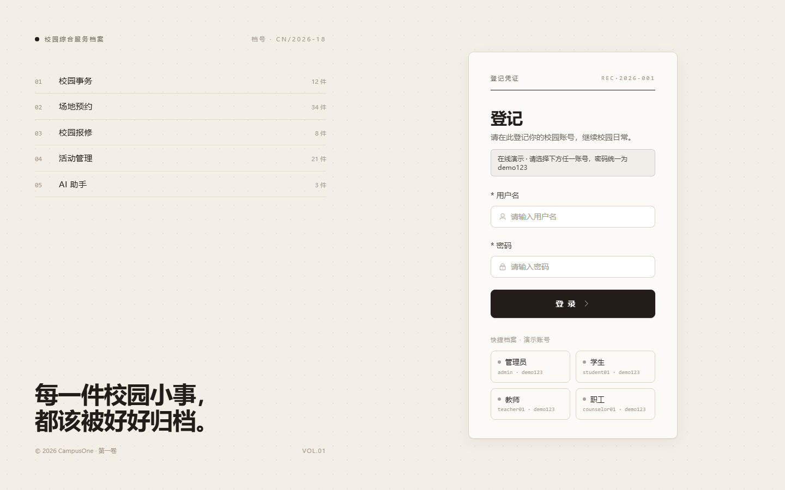
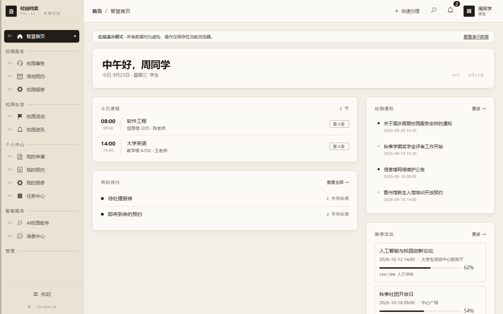
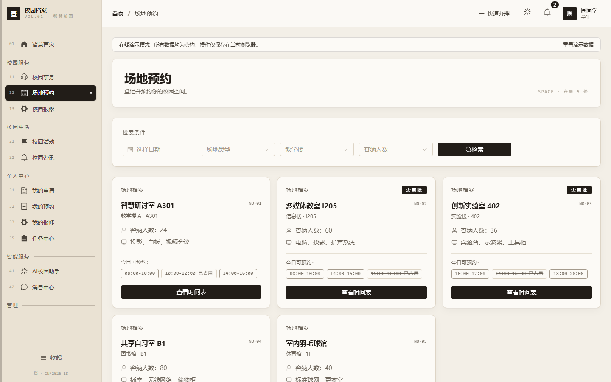
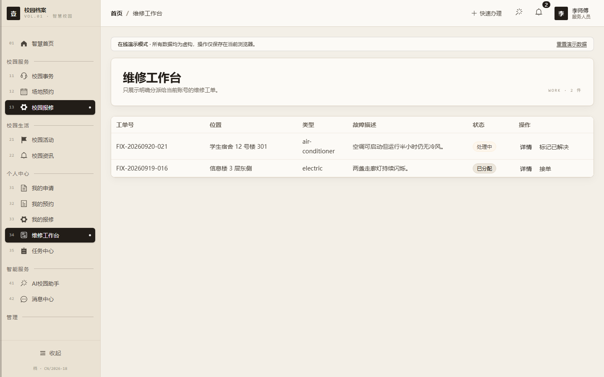
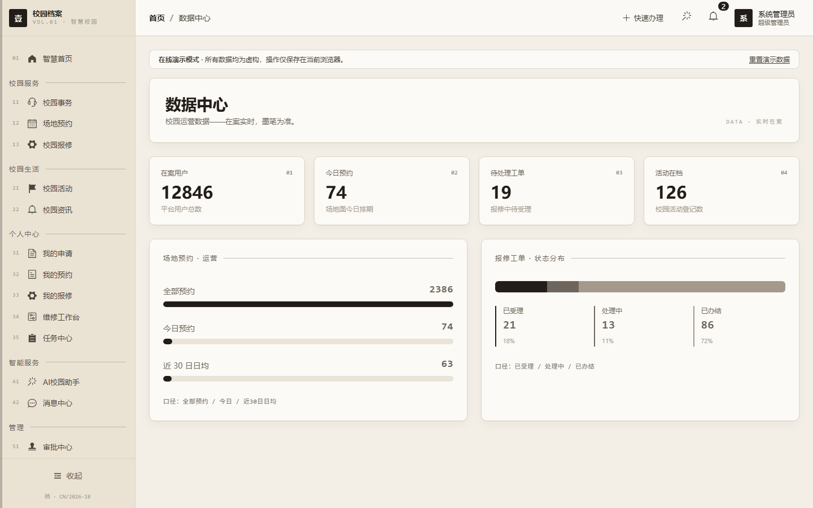
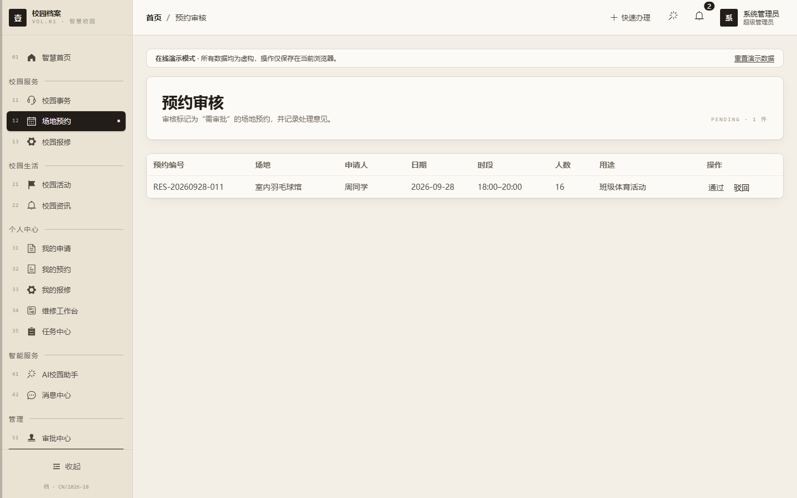

# CampusOne 智慧校园综合服务平台

CampusOne 是一个智慧校园综合服务项目，包含 Vue 3 Web 前端、Spring Boot 后端和 iOS 客户端。当前仓库同时提供一个可直接部署到 GitHub Pages 的纯前端在线演示版，方便其他人无需安装数据库或后端即可浏览和操作界面。

当前版本：**v1.2.1**。版本变化见 [CHANGELOG.md](CHANGELOG.md)。

## 系统设计

CampusOne 采用“多端客户端 + 模块化单体后端 + MySQL/Redis”的结构。Web 与 iOS 共用 REST API；申请审批、场地预约、校园报修、活动和通知分别保持清晰的业务边界。当前审批采用两级轻量状态机，服务目录使用稳定 ID，并由数据库迁移保证各环境一致。

- [系统总体设计](docs/SYSTEM_DESIGN.md)：产品边界、角色、架构决策与演进路线
- [业务流程与状态机](docs/BUSINESS_WORKFLOWS.md)：申请、预约、报修、活动和认证流程
- [API 与数据模型](docs/API_AND_DATA_MODEL.md)：接口契约、分页规范与核心数据关系
- [开发与部署指南](docs/DEVELOPMENT_AND_DEPLOYMENT.md)：演示、联调、测试和生产发布

文档只描述仓库中已经实现或明确标注为规划中的能力；GitHub Pages 是公开演示环境，真实多人业务需要独立部署后端和基础设施。

## 项目界面

### 登录与演示入口



### 学生端

| 智慧首页 | 场地预约 |
| --- | --- |
|  |  |

### 服务端与管理端

| 维修工作台 | 数据中心 |
| --- | --- |
|  |  |



## 在线演示模式

演示版使用浏览器内置的虚构数据，覆盖登录、首页、校园事务、场地预约、报修、活动、通知、审批、数据中心、系统管理和 AI 助手等主要流程。

- 演示账号：`admin`、`student01`、`teacher01`、`counselor01`、`service01`
- 演示密码：`demo123`
- 新建申请、预约和报修等操作仅保存在当前浏览器的 `localStorage`
- 页面顶部可一键重置演示数据
- 演示版不会连接真实后端，不会上传附件，也不会收集真实个人信息

本地预览演示版：

```bash
cd campus-one-frontend
npm ci
npm run build:demo
npm run preview
```

## 部署到 GitHub Pages

仓库已包含 [持续集成工作流](.github/workflows/ci.yml) 和 [Pages 自动部署工作流](.github/workflows/pages.yml)。发布步骤：

1. 将仓库推送到 GitHub，默认分支使用 `main`。
2. 打开仓库的 **Settings → Pages**。
3. 在 **Build and deployment** 中将 **Source** 设为 **GitHub Actions**。
4. 打开 **Actions**，等待 `Deploy CampusOne demo to GitHub Pages` 工作流完成。
5. Pages 页面会显示公开访问地址，之后每次向 `main` 推送都会自动更新。

演示版使用 Hash 路由和相对静态资源路径，因此既可部署在 `username.github.io` 根站点，也可部署在 `username.github.io/repository-name/` 项目子路径，刷新详情页不会返回 404。

## 技术栈

| 部分 | 技术 |
| --- | --- |
| Web 前端 | Vue 3、TypeScript、Vite、Pinia、Element Plus、Tailwind CSS |
| 后端 | Java 21、Spring Boot 3、Spring Security、MyBatis-Plus、MySQL、Redis |
| iOS | Swift / UIKit |
| 本地编排 | Docker Compose |

## 完整系统本地运行

GitHub Pages 只运行静态演示前端。若要使用真实登录、数据库、文件上传和服务端 API，请运行完整系统。

### Docker Compose

先复制环境变量模板并替换所有示例密钥：

```bash
cp .env.example .env
docker compose up --build
```

启动后：

- Web：`http://localhost:3000`
- 后端 API：`http://localhost:8080/api/v1`
- Swagger（`dev` 配置）：`http://localhost:8080/swagger-ui.html`

不要把 `.env`、数据库文件、上传文件或任何真实密钥提交到 GitHub。公开部署完整后端前，还应使用托管 MySQL/Redis、HTTPS、持久化文件存储，并关闭公网数据库端口与生产环境 Swagger。

生产数据库升级前应先备份并统计 `user_notification`、`resource_reservation` 等业务表规模，在同等数据量的副本演练 Flyway 迁移；涉及外键和索引的迁移应安排在低峰期执行，并监控 MySQL 元数据锁等待。

从旧版本升级后，超级管理员应在“系统管理 → 用户管理”中为教师、辅导员和管理员配置“全部 / 本学院 / 本班级 / 仅本人”的审批数据范围。系统不会根据用户名自动扩大权限；未配置匹配范围时，新申请会安全地停止路由并提示管理员处理。

### 分别运行

前端：

```bash
cd campus-one-frontend
npm ci
npm run dev
```

后端需要 Java 21、MySQL 8 和 Redis 7：

```bash
cd campus-one-backend
./mvnw spring-boot:run
```

Windows PowerShell 可使用 `./mvnw.cmd spring-boot:run`。

## 验证

```bash
# 前端正式构建
cd campus-one-frontend
npm run test:unit
npm run build

# Pages 演示构建
npm run build:demo

# 后端测试
cd ../campus-one-backend
./mvnw test
```

## 仓库结构

```text
campus-one-frontend/  Vue Web 前端与 Pages 演示数据
campus-one-backend/   Spring Boot API
campus-one-ios/       iOS 客户端
.github/workflows/    GitHub Pages 自动部署
docker-compose.yml    完整系统本地编排
```

## 部署边界

当前 GitHub Pages 方案面向作品展示和交互体验，不是生产业务环境。演示数据全部为虚构数据。若未来需要让多人共享真实数据、使用真实审批和账号体系，需要把后端、MySQL、Redis 和文件存储部署到独立云服务，并将前端 API 地址指向该服务。
